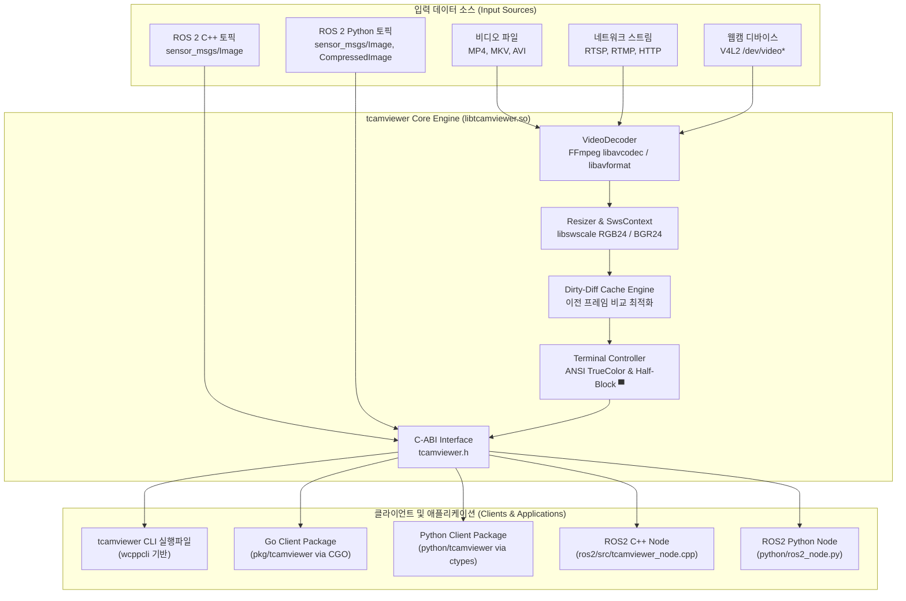

# tcamviewer (Terminal Camera & Video Viewer) - Architecture & Developer Guide

`tcamviewer`는 로컬 비디오 파일, RTSP/RTMP 네트워크 스트림, V4L2 웹캠, 그리고 ROS2 카메라 토픽(`sensor_msgs/msg/Image`, `sensor_msgs/msg/CompressedImage`)을 실시간으로 터미널에 렌더링해주는 고성능 터미널 비디오 플레이어 라이브러리이자 CLI 도구입니다.

본 문서는 프로젝트의 **전체 아키텍처, 핵심 알고리즘, C-ABI 인터페이스 명세, TDD 테스트 가이드, 클라이언트(Go, Python, ROS2 C++/Python) 연동 방법**을 상세히 기술합니다.

---

## 1. 시스템 아키텍처 (System Architecture)

`tcamviewer`는 **고성능 C++17 코어 엔진**을 중심으로 C-ABI(`.so`)를 노출하여 다양한 언어(Go, Python, ROS2)에서 제로카피에 준하는 초저지연 성능으로 임베드할 수 있도록 설계되었습니다.



---

## 2. 언어 및 라이브러리 선정 이유

| 구성 요소 | 기술 선택 | 선정 근거 |
| :--- | :--- | :--- |
| **코어 엔진** | **C++ (C++17)** | • **ROS2 1등 시민**: `rclcpp`와 직접 메모리 포인터 교환으로 제로카피 달성<br>• **FFmpeg 네이티브 연동**: C API를 통한 하드웨어 가속 및 초저지연 디코딩<br>• **C-ABI 제공**: Go, Python, Rust 등 타 언어로 바인딩이 가장 용이함 |
| **CLI 프레임워크** | **`wcppcli`** (`github.com/wkqco33/wcppcli`) | • C++17 기반의 제로 디펜던시 초경량 CLI 프레임워크<br>• 계층형 명령어/플래그 파싱 및 `WLog` 스타일 로깅 통합 |
| **비디오 디코딩** | **FFmpeg (avcodec, avformat, swscale)** | • 파일(MP4), 실시간 스트림(RTSP low-latency TCP), 웹캠(V4L2)을 표준화된 파이프라인으로 통합 |
| **터미널 렌더링** | **Half-Block (`▀`) + TrueColor (24-bit)** | • 문자 1개당 세로 2픽셀(1:1 비율) 표현 (80×24 터미널 → 80×48 픽셀 해상도)<br>• 자체 더블버퍼링 및 Dirty-diff 캐시로 터미널 I/O 70% 절감 |
| **Go 클라이언트** | **CGO (`pkg/tcamviewer`)** | • Go 백엔드 또는 도구에서 C++ 라이브러리를 네이티브 속도로 호출 |
| **Python 클라이언트** | **`ctypes` (`python/tcamviewer`)** | • 별도의 C-Extension 컴파일 없이 표준 라이브러리 `ctypes`로 즉시 로딩 |
| **ROS2 클라이언트** | **C++ (`rclcpp`) & Python (`rclpy`)** | • 성능 중심의 로봇 시스템: C++ 노드<br>• 프로토타이핑/AI 파이프라인: Python 노드 |

---

## 3. 핵심 렌더링 알고리즘 & 최적화 기법

### (1) Half-Block TrueColor 렌더링 원리
터미널 글꼴의 일반적인 종횡비는 가로:세로 약 **1:2**입니다.
- 유니코드 상단 반쪽 블록 문자 **`▀` (`\xE2\x96\x80`)**을 사용합니다.
- **전경색(Foreground)**: 상단 픽셀 색상 (`\x1b[38;2;R;G;B;m`)
- **배경색(Background)**: 하단 픽셀 색상 (`\x1b[48;2;R;G;B;m`)
- 결과적으로 문자 셀 1개가 정사각형에 가까운 1×2 픽셀을 표현하므로, 화면 왜곡 없이 비디오가 재생됩니다.

### (2) Dirty-Diff 캐싱 최적화
매 프레임 터미널 전체 화면을 지우거나 전체 ANSI 코드를 전송하면 초당 수십만 개의 이스케이프 시퀀스가 발생하여 터미널 에뮬레이터 지연 및 깜빡임(flicker)이 발생합니다.
- `prevGrid_`와 `currGrid_`를 셀 단위로 비교합니다.
- **차분이 적을 때 (변경율 < 40%)**: 변경된 셀의 위치로 커서를 직접 이동(`\x1b[Row;ColH`)하여 변경된 블록만 갱신합니다.
- **차분이 많을 때**: 커서를 홈(`\x1b[H`)으로 옮겨 순차 출력하되, 인접한 셀의 전경색/배경색이 동일하면 중복 ANSI 색상 코드를 생략합니다.
- 단 한 번의 `write(STDOUT_FILENO, ...)` 호출로 프레임 전체를 출력합니다.

### (3) Zero-Allocation & SIMD 친화적 최적화
- **64비트 단일 레지스터 셀 비교**: `CellColor`를 `alignas(8)` 8바이트로 정렬하여 단 1회의 64비트 레지스터 비교(`uint64_t`)로 셀 변경 여부를 판별합니다.
- **Zero-Allocation 10진수 포맷터**: `std::to_string` 및 임시 문자열 힙 할당을 완전히 배제하고, 인라인 10진수 스트리밍(`appendUint8`, `appendFgRgb`, `appendCursorMove`)으로 `outputBuffer_`에 직접 기록합니다.
- **가로축 좌표 변환 사전계산 (X-LUT)**: 행마다 중복되던 수평 나눗셈 연산을 1D LUT로 사전 계산하여 캐시 히트율을 극대화하고 루프 내 조건 분기를 최소화했습니다.
- **그리드 버퍼 재사용**: `currGrid_`와 `prevGrid_` 벡터를 멤버 변수로 영구 재사용하여 프레임당 동적 메모리 할당(malloc/free) 오버헤드를 0으로 유지합니다.

---

## 4. 디렉터리 구조 (Directory Structure)

```
tcamviewer/
├── CMakeLists.txt                # 메인 C++ CMake 빌드 설정
├── Taskfile.yml                  # Taskfile 빌드, 테스트, 실행 자동화 명세
├── README.md                     # 프로젝트 사용자 및 개발 가이드
├── AGENTS.md                     # 시스템 상세 아키텍처 및 개발자 가이드 (본 문서)
├── CONTRIBUTING.md               # 오픈소스 기여 가이드라인
├── SECURITY.md                   # 보안 취약점 보고 및 지원 정책
├── LICENSE                       # Apache License 2.0 라이선스 전문
├── .clang-format                 # C++ 코드 스타일 포맷터 설정 (Google C++ 기반)
├── .editorconfig                 # 에디터 공통 인덴트 및 개행 설정
├── .github/
│   ├── workflows/ci.yml          # GitHub Actions CI 자동화 워크플로우
│   ├── ISSUE_TEMPLATE/           # 버그 리포트 및 기능 제안 템플릿
│   └── PULL_REQUEST_TEMPLATE.md  # PR 템플릿
├── go.mod                        # Go 모듈 정의
├── third_party/
│   └── wcppcli/                  # wcppcli CLI 프레임워크 (서브모듈)
├── include/
│   └── tcamviewer/
│       ├── tcamviewer.h          # C-ABI 공개 헤더 (C, Go, Python FFI)
│       ├── terminal.hpp          # 터미널 크기 감지 및 이스케이프 시퀀스
│       ├── renderer.hpp          # Half-block TrueColor 렌더러
│       └── decoder.hpp           # FFmpeg 비디오/스트림 디코더
├── src/
│   ├── terminal.cpp              # Terminal 구현체
│   ├── renderer.cpp              # Renderer 구현체 (Zero-allocation 최적화)
│   ├── decoder.cpp               # VideoDecoder 구현체
│   ├── c_api.cpp                 # C-ABI 구현체
│   └── cli/
│       └── main.cpp              # tcamviewer CLI 실행파일 (wcppcli 연동)
├── tests/
│   ├── CMakeLists.txt            # 테스트 CMake 빌드 설정
│   ├── test_terminal.cpp         # 터미널 모듈 단위 테스트
│   ├── test_renderer.cpp         # 렌더러 & Diff 캐시 & 벤치마크 단위 테스트
│   ├── test_c_api.cpp            # C-ABI 단위 테스트
│   └── test_decoder.cpp          # 디코더 단위 테스트
├── pkg/
│   └── tcamviewer/               # Go 클라이언트 패키지 (CGO)
│       ├── tcamviewer.go
│       └── tcamviewer_test.go    # Go 단위 테스트
├── python/                       # Python 클라이언트 및 ROS2 노드
│   ├── tcamviewer/
│   │   ├── __init__.py
│   │   └── client.py             # ctypes 기반 Python 바인딩
│   ├── ros2_node.py              # ROS2 Jazzy rclpy 노드
│   └── tests/
│       └── test_client.py        # Python 단위 테스트
├── ros2/                         # ROS2 C++ 네이티브 패키지 (colcon)
│   ├── CMakeLists.txt
│   ├── package.xml
│   └── src/
│       └── tcamviewer_node.cpp   # rclcpp 기반 초저지연 노드
└── examples/
    ├── go/
    │   └── main.go               # Go 클라이언트 예제
    └── python/
        └── demo.py               # Python 클라이언트 데모
```

---

## 5. C-ABI 명세 (`include/tcamviewer/tcamviewer.h`)

Go의 CGO, Python의 `ctypes`, Rust의 FFI 등 모든 언어에서 바인딩 가능한 C 인터페이스입니다.

```c
// 터미널 크기 조회
tcam_status_t tcam_get_terminal_size(int* out_cols, int* out_rows);

// 렌더러 생성 및 해제
tcam_renderer_t* tcam_renderer_create(const tcam_render_config_t* config);
void tcam_renderer_destroy(tcam_renderer_t* renderer);

// 동적 리사이즈
tcam_status_t tcam_renderer_resize(tcam_renderer_t* renderer, int cols, int rows);

// RGB24 / BGR24 프레임 터미널 렌더링
tcam_status_t tcam_renderer_render_rgb24(tcam_renderer_t* renderer,
                                         const uint8_t* rgb_data,
                                         int width, int height, int stride);
tcam_status_t tcam_renderer_render_bgr24(tcam_renderer_t* renderer,
                                         const uint8_t* bgr_data,
                                         int width, int height, int stride);

// 비디오 디코더 생성 및 프레임 디코딩
tcam_decoder_t* tcam_decoder_create(const char* source, bool loop);
void tcam_decoder_destroy(tcam_decoder_t* decoder);
tcam_status_t tcam_decoder_read_frame(tcam_decoder_t* decoder,
                                      int target_width, int target_height,
                                      const uint8_t** out_rgb,
                                      int* out_width, int* out_height, int* out_stride);
```

---

## 6. 클라이언트 개발 및 사용 가이드

### (1) Go 언어 클라이언트 (`pkg/tcamviewer`)

CGO를 통해 C-ABI 라이브러리와 네이티브로 연동됩니다.

```go
package main

import (
    "github.com/wkqco33/tcamviewer/pkg/tcamviewer"
)

func main() {
    cols, rows, _ := tcamviewer.GetTerminalSize()
    renderer, _ := tcamviewer.NewRenderer(tcamviewer.Config{
        TargetCols: cols,
        TargetRows: rows,
        UseDiff:    true,
        AltScreen:  true,
        HideCursor: true,
    })
    defer renderer.Close()

    // rgbData: []byte (width * height * 3)
    renderer.RenderRGB(rgbData, width, height, stride)
}
```

- **Go 단위 테스트 실행**:
  ```bash
  go test -v ./pkg/tcamviewer
  ```
- **Go 예제 실행**:
  ```bash
  go run ./examples/go/main.go
  ```

---

### (2) Python 언어 클라이언트 (`python/tcamviewer`)

`ctypes`를 사용하여 C 컴파일 단계 없이 `libtcamviewer.so`를 즉시 로딩합니다. NumPy 배열 및 일반 바이트 버퍼를 모두 지원합니다.

```python
from tcamviewer import TerminalRenderer, get_terminal_size

cols, rows = get_terminal_size()
renderer = TerminalRenderer(cols=cols, rows=rows, use_diff=True)

# data: bytes 또는 numpy.ndarray
renderer.render_rgb(data, width=640, height=480)
renderer.close()
```

- **Python 단위 테스트 실행**:
  ```bash
  python3 -m unittest discover -s python/tests
  ```
- **Python 데모 실행**:
  ```bash
  python3 ./examples/python/demo.py
  ```

---

### (3) ROS2 연동 가이드 (Python & C++)

#### A. Python ROS2 노드 (`python/ros2_node.py`)
`rclpy` 환경에서 빠른 모니터링이 필요할 때 사용합니다. `sensor_msgs/msg/Image` 및 `sensor_msgs/msg/CompressedImage`를 모두 지원합니다.

```bash
# ROS2 환경 활성화
source /opt/ros/jazzy/setup.bash

# Raw 이미지 토픽 구독
python3 python/ros2_node.py --ros-args -p topic:=/camera/image_raw

# 압축(Compressed) 이미지 토픽 구독
python3 python/ros2_node.py --ros-args -p topic:=/camera/image_raw/compressed -p compressed:=true
```

#### B. C++ ROS2 네이티브 노드 (`ros2/`)
제로카피 수준의 초저지연과 극도의 CPU 효율이 필요할 때 사용합니다.

```bash
# ROS2 패키지 빌드
source /opt/ros/jazzy/setup.bash
colcon build --paths ros2

# 노드 실행
source install/setup.bash
ros2 run tcamviewer_ros2 tcamviewer_node --ros-args -p topic:=/camera/image_raw
```

---

### (4) CLI 도구 사용법 (`tcamviewer`)

`wcppcli`를 기반으로 제작된 독립 CLI 도구입니다.

```bash
# 1. 터미널 렌더링 성능 및 TrueColor 테스트 패턴 실행 (5초간 30fps 재생)
./build/tcamviewer test --duration 5 --fps 30

# 2. 로컬 비디오 파일 재생 (반복 재생 옵션)
./build/tcamviewer play /path/to/video.mp4 --loop

# 3. RTSP 저지연 스트림 재생
./build/tcamviewer play rtsp://192.168.1.100:554/stream1

# 4. V4L2 USB 웹캠 실시간 재생
./build/tcamviewer play /dev/video0
```

---

## 7. TDD (Test-Driven Development) 가이드

프로젝트의 모든 핵심 컴포넌트는 TDD 철학에 따라 단위 테스트가 작성되어 있습니다.

### C++ 테스트 (GoogleTest & CTest)
```bash
mkdir -p build && cd build
cmake ..
make -j$(nproc)
ctest --output-on-failure
# 또는 직접 바이너리 실행
./tests/tcamviewer_tests
```
- `TerminalTest`: ANSI 이스케이프 시퀀스 정확성, 터미널 크기 감지
- `RendererTest`: RGB/BGR 픽셀 매핑, Half-block 출력, Dirty-diff 최적화, 리사이즈, 90/180/270도 회전, 종횡비 자동 유지(Fit/Stretch), 초고속 렌더링 벤치마크(`BenchmarkPerformance`)
- `CApiTest`: C 인터페이스 수명주기, 버퍼 렌더링, 널 포인터 안전성
- `DecoderTest`: 잘못된 소스 예외 처리, 비정상 스트림 방어

### Go 테스트
```bash
go test -v ./pkg/tcamviewer
```

### Python 테스트
```bash
python3 -m unittest discover -s python/tests
```

---

## 8. 향후 로드맵 (Roadmap)

자세한 중장기 개발 마일스톤 및 기술 스펙은 [ROADMAP.md](ROADMAP.md)를 참고하세요.

1. **터미널 그래픽스 프로토콜 확장 (v0.2.0)**:
   - Kitty Graphics Protocol 및 Sixel 지원 플러그인 추가 (고화질 터미널에서 픽셀 단위 60fps 풀HD 렌더링)
   - 프로토콜 자동 협상(Auto-negotiation) 기능
2. **IPC 공유 메모리(Shared Memory) 파이프라인 (v0.3.0)**:
   - 별도 프로세스 간 프레임 공유를 위한 POSIX shm 및 락프리 링 버퍼 파이프라인
3. **OSD (On-Screen Display) 오버레이 (v0.4.0)**:
   - 터미널 비디오 상단에 실시간 FPS, 해상도, 타임스탬프, 토픽 이름, AI 바운딩 박스 텍스트 오버레이 기능 추가
4. **ARM NEON 가속 및 ROS 공식 패키지 인덱싱 (v0.5.0)**:
   - 라즈베리파이/Jetson NEON SIMD 최적화 및 `rosdistro` 등록
