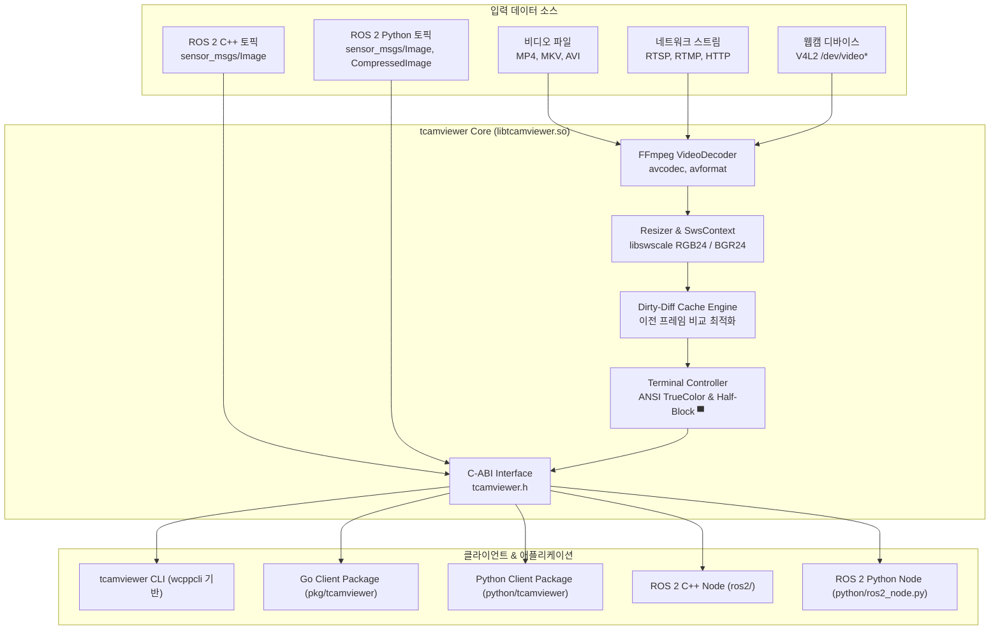

# tcamviewer 📹

[](https://github.com/wkqco33/tcamviewer/actions)
[](LICENSE)


> **고성능 터미널 비디오 플레이어 & ROS 2 카메라 토픽 모니터 라이브러리**  
> 파일(MP4/MKV), 실시간 네트워크 스트림(RTSP/RTMP), V4L2 웹캠, 그리고 ROS 2 카메라 토픽을 터미널에서 실시간(30~60+ FPS)으로 렌더링합니다.

---

## ✨ 핵심 기능 (Key Features)

- **🎨 Half-Block TrueColor (24-bit ANSI) 렌더링**:
  - 유니코드 상단 반쪽 블록 문자(`▀`, U+2580)의 전경색(FG)과 배경색(BG)을 분리하여 **문자 셀 1개당 세로 2픽셀(1:1 비율)**을 표현합니다.
  - 폰트 왜곡 없이 일반 터미널(예: 80×24)에서 80×48 픽셀 해상도로 비디오를 부드럽게 재생합니다.
- **⚡ Dirty-Diff 캐시 및 Zero-Allocation 스트리밍**:
  - 이전 프레임과 현재 프레임을 64비트 레지스터 단위로 비교하여 **변경된 영역만 ANSI 커서 점프(`\x1b[Row;ColH`)로 업데이트**합니다.
  - 힙 할당 없는 인라인 10진수 포맷터 및 X-LUT 사전 계산을 적용하여 초당 수만 프레임의 연산 처리 성능을 보장하며, 터미널 I/O를 70% 이상 절감합니다.
- **🌐 범용 비디오 소스 디코딩 (FFmpeg)**:
  - 로컬 비디오 파일 (MP4, MKV, AVI, WebM 등)
  - 네트워크 스트림 (RTSP low-latency TCP, RTMP, HTTP)
  - V4L2 USB 웹캠 디바이스 (`/dev/video0`)
- **🔌 제로카피 C-ABI 및 다국어 클라이언트 생태계**:
  - **C++ (C++17)**: 코어 엔진 및 초저지연 ROS 2 C++ 네이티브 노드 (`rclcpp`)
  - **Go**: CGO 기반의 고성능 패키지 (`pkg/tcamviewer`)
  - **Python**: 표준 라이브러리 `ctypes` 기반 바인딩 (`python/tcamviewer`) 및 ROS 2 Python 노드 (`rclpy`)
- **🖥️ 고성능 CLI 인터페이스**:
  - 경량 C++ CLI 프레임워크 [`wcppcli`](https://github.com/wkqco33/wcppcli) 기반으로 제작되어 명령어, 플래그 파싱 및 정형화된 로깅 지원.
- **📋 Taskfile 기반 자동화**:
  - 빌드, 테스트(TDD), 클린, 예제 실행을 단일 명령어로 손쉽게 관리.

---

## 🏗️ 시스템 아키텍처



---

## 📦 요구사항 및 의존성

- **운영체제**: Linux (Ubuntu 24.04 / 22.04 권장)
- **컴파일러**: C++17 지원 컴파일러 (`g++` 또는 `clang++`)
- **빌드 도구**: `cmake` (3.16+), `pkg-config`, `task` ([go-task](https://taskfile.dev))
- **필수 라이브러리**:
  ```bash
  sudo apt-get update && sudo apt-get install -y \
      libavcodec-dev libavformat-dev libswscale-dev libavutil-dev \
      libgtest-dev pkg-config cmake build-essential
  ```
- **선택 사항**:
  - Go 1.22+ (Go 클라이언트 사용 시)
  - Python 3.10+ (Python 바인딩 사용 시)
  - ROS 2 Jazzy 또는 Humble (ROS 2 노드 실행 시)

---

## ⚡ Taskfile 명령어 가이드

프로젝트 루트에 작성된 `Taskfile.yml`을 통해 프로젝트의 모든 작업을 손쉽게 관리할 수 있습니다.

```bash
# 사용 가능한 전체 태스크 목록 보기
task
```

| 명령어 | 설명 |
| :--- | :--- |
| **`task build`** | C++ 코어 라이브러리(`libtcamviewer.so`), CLI 실행파일, 테스트 바이너리 빌드 |
| **`task build:core`** | `libtcamviewer.so` 코어 동적 라이브러리만 빌드 |
| **`task build:cli`** | 독립형 `tcamviewer` CLI 바이너리만 빌드 |
| **`task build:ros2`** | `colcon`을 사용하여 ROS 2 Jazzy C++ 노드 패키지 빌드 |
| **`task build:all`** | C++, CLI, 테스트, ROS 2 패키지를 모두 빌드 |
| **`task test`** | **C++(GoogleTest), Go, Python 모든 단위 테스트 일괄 실행** |
| **`task test:cpp`** | C++ GoogleTest 단위 테스트 (17개 항목 + 고해상도 벤치마크) 실행 |
| **`task test:go`** | Go CGO 패키지 단위 테스트 실행 |
| **`task test:py`** | Python `ctypes` 단위 테스트 실행 |
| **`task example:cli`** | CLI 30 FPS 애니메이션 테스트 패턴 실행 (3초간 렌더링) |
| **`task example:go`** | Go 언어로 구현된 비디오 렌더링 데모 실행 |
| **`task example:py`** | Python 언어로 구현된 비디오 렌더링 데모 실행 |
| **`task example:ros2-py`** | Python ROS 2 카메라 토픽 수신 노드 실행 (`/camera/image_raw`) |
| **`task example:ros2-cpp`**| C++ 네이티브 ROS 2 카메라 토픽 수신 노드 실행 |
| **`task install`** | 라이브러리, 헤더, CLI를 시스템 디렉토리에 설치 |
| **`task clean`** | 빌드 산출물(`build/`, `install/`, `log/`, `__pycache__`) 정리 |

---

## 🚀 사용법 (Usage)

### 1. CLI 도구 (`tcamviewer`)

`wcppcli` 기반으로 빌드된 CLI 실행파일은 파일 재생, 실시간 스트리밍, 성능 테스트를 지원합니다.

```bash
# 1. 터미널 TrueColor 및 렌더링 속도 테스트 패턴 실행 (30 FPS)
./build/tcamviewer test --duration 5 --fps 30

# 2. 로컬 비디오 파일 재생 (반복 재생 옵션)
./build/tcamviewer play /path/to/video.mp4 --loop

# 3. RTSP 저지연 네트워크 스트림 재생
./build/tcamviewer play rtsp://192.168.1.100:554/stream1

# 4. USB 웹캠 실시간 모니터링
./build/tcamviewer play /dev/video0

# 5. 회전 보정 (90도/180도/270도 시계방향 회전)
# 스마트폰 영상이나 카메라가 90도 기울어져 있을 때
./build/tcamviewer play /path/to/video.mp4 --rotate 90
# 단축 플래그
./build/tcamviewer play /path/to/video.mp4 -r 90

# 6. 종횡비 유지 (기본 활성화: 화면 크기에 맞춰 비율 자동 유지 및 중앙 정렬)
# 비율 무시하고 터미널 전체로 늘리기(Stretch) 옵션:
./build/tcamviewer play /path/to/video.mp4 --stretch

# 7. CLI 옵션 도움말 확인
./build/tcamviewer --help
./build/tcamviewer play --help
```

> 💡 **재생 중 인터랙티브 키 제어**:
> - **`a` 또는 `A`**: **종횡비 유지(Fit) ↔ 터미널 채우기(Stretch)** 실시간 토글!
> - **`r` 또는 `R`**: 재생 중에 누르면 실시간으로 시계 방향 90도 회전 (+90° → +180° → +270° → 0°)
> - **`q` 또는 `Q`**: 재생 종료
> - **`Ctrl+C`**: 안전한 터미널 복구 및 종료

---

### 2. ROS 2 카메라 모니터링

#### (1) Python 노드 (`python/ros2_node.py`)
`rclpy` 환경에서 즉시 실행 가능하며, `sensor_msgs/msg/Image` 및 `sensor_msgs/msg/CompressedImage`를 모두 지원합니다.

```bash
source /opt/ros/jazzy/setup.bash

# 기본 Raw 이미지 토픽 구독 (/camera/image_raw)
python3 python/ros2_node.py

# 특정 토픽 지정 및 90도 회전 보정
python3 python/ros2_node.py --ros-args -p topic:=/camera/image_raw -p rotation:=90

# 압축(Compressed) 토픽 구독
python3 python/ros2_node.py --ros-args -p topic:=/camera/image_raw/compressed -p compressed:=true
```

#### (2) C++ 네이티브 노드 (`ros2/`)
초저지연과 극도의 CPU 효율이 필요할 때 사용합니다.

```bash
# 빌드
task build:ros2

# 실행 (90도 회전 보정 예시)
source /opt/ros/jazzy/setup.bash
source install/setup.bash
ros2 run tcamviewer_ros2 tcamviewer_node --ros-args -p topic:=/camera/image_raw -p rotation:=90
```

---

### 3. Go 클라이언트 개발 (`pkg/tcamviewer`)

CGO를 통해 C-ABI 라이브러리와 네이티브로 연동됩니다.

```go
package main

import (
    "github.com/wkqco33/tcamviewer/pkg/tcamviewer"
)

func main() {
    cols, rows, _ := tcamviewer.GetTerminalSize()
    renderer, _ := tcamviewer.NewRenderer(tcamviewer.Config{
        TargetCols: cols,
        TargetRows: rows,
        UseDiff:    true,
        AltScreen:  true,
        HideCursor: true,
    })
    defer renderer.Close()

    // rgbData: []byte (width * height * 3)
    renderer.RenderRGB(rgbData, width, height, stride)
}
```

- **예제 실행**:
  ```bash
  task example:go
  ```

---

### 4. Python 클라이언트 개발 (`python/tcamviewer`)

`ctypes`를 사용하여 별도의 C-Extension 컴파일 없이 `libtcamviewer.so`를 즉시 로딩합니다. NumPy 배열 및 바이트 버퍼를 모두 지원합니다.

```python
from tcamviewer import TerminalRenderer, get_terminal_size
import numpy as np

cols, rows = get_terminal_size()
renderer = TerminalRenderer(cols=cols, rows=rows, use_diff=True)

# data: bytes 또는 numpy.ndarray (H x W x 3)
image = np.zeros((480, 640, 3), dtype=np.uint8)
renderer.render_rgb(image, width=640, height=480)
renderer.close()
```

- **예제 실행**:
  ```bash
  task example:py
  ```

---

## 🧪 TDD (Test-Driven Development) 테스트

모든 컴포넌트는 TDD 원칙에 따라 단위 테스트가 작성되어 있으며, 단일 명령어로 전체 테스트 스위트를 검증할 수 있습니다:

```bash
task test
```

- **C++ Tests (`tests/`, 17개 항목)**:
  - `TerminalTest`: ANSI 이스케이프 코드 유효성 검증, 터미널 크기 감지
  - `RendererTest`: RGB/BGR 픽셀 매핑, Half-block 출력, Dirty-diff 최적화, 리사이즈, 종횡비(Fit/Stretch), 회전(0/90/180/270), 초고속 렌더링 벤치마크(`BenchmarkPerformance`)
  - `CApiTest`: C-ABI 메모리 수명주기, 버퍼 렌더링, 널 포인터 안전성
  - `DecoderTest`: 잘못된 소스 방어 및 예외 처리
- **Go Tests (`pkg/tcamviewer/tcamviewer_test.go`)**:
  - 터미널 크기 조회, 버퍼 렌더링, 수명 주기, 회전 및 종횡비 제어 검증
- **Python Tests (`python/tests/test_client.py`)**:
  - ctypes 라이브러리 로드, 버퍼 렌더링, 문자열 블록 일치, 회전 및 종횡비 제어 검증

---

## 📁 디렉터리 구조

```
tcamviewer/
├── CMakeLists.txt                # 메인 C++ CMake 빌드 파일
├── Taskfile.yml                  # Taskfile 빌드, 테스트, 실행 자동화 명세
├── README.md                     # 프로젝트 사용자 및 개발 가이드 (본 문서)
├── AGENTS.md                     # 시스템 상세 아키텍처 및 개발자 가이드
├── ROADMAP.md                    # 프로젝트 중장기 개발 로드맵 및 마일스톤
├── CONTRIBUTING.md               # 오픈소스 기여 가이드라인
├── SECURITY.md                   # 보안 취약점 보고 및 지원 정책
├── LICENSE                       # Apache License 2.0 라이선스 전문
├── .clang-format                 # C++ 코드 스타일 포맷터 설정 (Google C++ 기반)
├── .editorconfig                 # 에디터 공통 인덴트 및 개행 설정
├── .github/
│   ├── workflows/ci.yml          # GitHub Actions CI 자동화 워크플로우
│   ├── ISSUE_TEMPLATE/           # 버그 리포트 및 기능 제안 템플릿
│   └── PULL_REQUEST_TEMPLATE.md  # PR 템플릿
├── go.mod                        # Go 모듈 파일
├── third_party/
│   └── wcppcli/                  # wcppcli CLI 프레임워크 (서브모듈)
├── include/
│   └── tcamviewer/
│       ├── tcamviewer.h          # C-ABI 공개 헤더 (C, Go, Python FFI)
│       ├── terminal.hpp          # 터미널 창 제어 및 ANSI 이스케이프
│       ├── renderer.hpp          # Half-block TrueColor 및 Diff 렌더러
│       └── decoder.hpp           # FFmpeg 비디오/스트림 디코더
├── src/
│   ├── terminal.cpp              # Terminal 구현체
│   ├── renderer.cpp              # Renderer 구현체 (Zero-allocation 최적화)
│   ├── decoder.cpp               # VideoDecoder 구현체
│   ├── c_api.cpp                 # C-ABI 구현체
│   └── cli/
│       └── main.cpp              # wcppcli 연동 CLI 실행파일
├── tests/
│   ├── CMakeLists.txt            # 단위 테스트 CMake 파일
│   ├── test_terminal.cpp         # 터미널 단위 테스트
│   ├── test_renderer.cpp         # 렌더러 & Diff 캐시 & 벤치마크 단위 테스트
│   ├── test_c_api.cpp            # C-ABI 인터페이스 단위 테스트
│   └── test_decoder.cpp          # 디코더 단위 테스트
├── pkg/
│   └── tcamviewer/               # Go 클라이언트 패키지 (CGO)
│       ├── tcamviewer.go
│       └── tcamviewer_test.go
├── python/                       # Python 클라이언트 및 ROS 2 노드
│   ├── tcamviewer/
│   │   ├── __init__.py
│   │   └── client.py             # ctypes 기반 Python 바인딩
│   ├── ros2_node.py              # ROS 2 Jazzy rclpy 노드
│   └── tests/
│       └── test_client.py        # Python 단위 테스트
├── ros2/                         # ROS 2 C++ 네이티브 패키지 (colcon)
│   ├── CMakeLists.txt
│   ├── package.xml
│   └── src/
│       └── tcamviewer_node.cpp   # rclcpp 기반 초저지연 노드
└── examples/
    ├── go/
    │   └── main.go               # Go 클라이언트 데모
    └── python/
        └── demo.py               # Python 클라이언트 데모
```

---

## 🤝 기여하기 (Contributing) & 보안 정책 (Security)

- 프로젝트 기여 방법 및 개발 워크플로우는 [CONTRIBUTING.md](CONTRIBUTING.md)를 참고해 주세요.
- 향후 개발 계획 및 마일스톤은 [ROADMAP.md](ROADMAP.md)를 참고해 주세요.
- 보안 취약점 보고 및 정책에 관한 안내는 [SECURITY.md](SECURITY.md)를 참고해 주세요.

---

## 📄 라이선스 (License)

본 프로젝트는 [Apache License 2.0](LICENSE) 라이선스 하에 배포됩니다.
자유롭게 수정, 배포 및 상업적 이용이 가능합니다.
