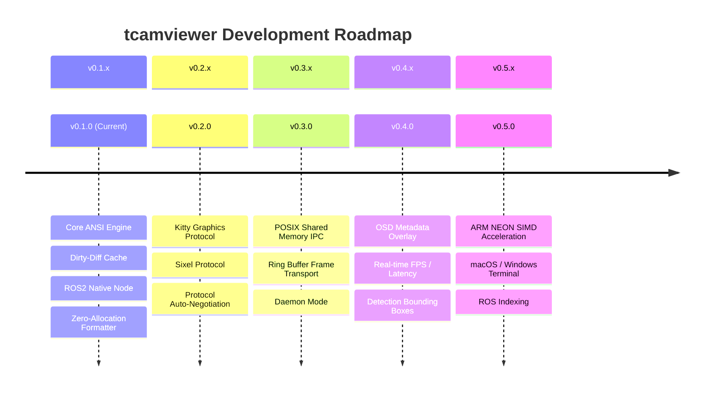

# tcamviewer Project Roadmap

본 문서는 `tcamviewer`의 중장기 개발 방향과 주요 마일스톤, 기술적 목표를 기술합니다.  
`tcamviewer`는 GUI 환경(X11/Wayland)이 없는 원격 서버, 임베디드 로봇(Jetson/라즈베리파이), 클라우드 컨테이너 환경에서 초저지연·고성능 카메라 및 비디오 모니터링 표준 도구를 지향합니다.

---

## 🗺️ 마일스톤 및 릴리즈 계획

---

### 1. Milestone 1: 차세대 터미널 그래픽스 프로토콜 플러그인 (v0.2.0)
현재의 Half-Block(`▀`) ANSI TrueColor 방식은 모든 ANSI 터미널에서 작동하지만, 글자 셀 크기의 제약(예: 80×48 픽셀)이 있습니다. 최신 터미널 프로토콜을 도입하여 모니터 네이티브 픽셀 해상도를 지원합니다.

- **Kitty Graphics Protocol 지원**:
  - Kitty, Ghostty, WezTerm 등 최신 터미널에서 픽셀 단위 60 FPS Full-HD 렌더링.
  - RGBA/RGB24 청크 스트리밍 전송 파이프라인.
- **Sixel 그래픽 프로토콜 지원**:
  - Foot, Alacritty(Sixel 패치), Mintty 등 전통적인 터미널 환경 지원.
  - 고속 팔레트 양자화(Fast Octree Quantization) 구현.
- **프로토콜 자동 협상 (Auto-Negotiation)**:
  - 터미널 응답 쿼리(`CSI c`, `XTGETTCAP`)를 통해 지원 프로토콜을 자동 판별.
  - 최우선 순위: `Kitty` → `Sixel` → `Half-Block TrueColor`로 자동 폴백.

---

### 2. Milestone 2: IPC 공유 메모리(Shared Memory) 파이프라인 (v0.3.0)
ROS 2 외에도 C++, Python, Rust 기반의 인공지능/비전 프로세스와 별도 프로세스 간 제로카피 프레임 공유를 구현합니다.

- **POSIX Shared Memory (`/dev/shm`) 기반 IPC**:
  - 메모리 복사 없이 영상 프레임 버퍼를 실시간으로 공유하는 C-ABI 헤더 및 라이브러리.
  - POSIX 세마포어 기반 락프리 링 버퍼(Lock-free Ring Buffer) 동기화.
- **데몬 모드 (`tcamviewer listen`)**:
  - 백그라운드 영상 파이프라인에서 공유 메모리로 주입한 영상을 실시간 표시하는 수신 CLI 모드.

---

### 3. Milestone 3: OSD (On-Screen Display) 오버레이 & 비전 메타데이터 (v0.4.0)
영상 재생 및 모니터링 시 터미널 화면 상단에 유용한 실시간 통계 정보를 오버레이합니다.

- **실시간 성능 및 상태 OSD**:
  - 렌더링 FPS, 소스 원본 해상도, 터미널 해상도, 스트림 지연시간(Latency).
  - ROS 2 토픽 이름, 프레임 타임스탬프, 프레임 드랍 카운트.
- **객체 검출 바운딩 박스 (Bounding Box) 오버레이**:
  - YOLO 등 AI 모델의 탐지 결과(JSON/Protobuf/ROS Detection2D)를 수신하여 터미널 화면 위에 경계 상자와 클래스 라벨 실시간 렌더링.

---

### 4. Milestone 4: 하드웨어 가속 및 패키징 생태계 확장 (v0.5.0)

- **ARM NEON SIMD 최적화**:
  - 라즈베리파이 4/5 및 NVIDIA Jetson 환경에서 RGB 변환 및 Diff 연산을 ARM NEON 벡터 명령어로 가속.
- **ROS 2 공식 패키지 인덱싱 (`rosdistro`)**:
  - `ros-jazzy-tcamviewer`, `ros-humble-tcamviewer` 바이너리 APT 패키지 배포.
- **크로스 플랫폼 지원**:
  - macOS (iTerm2 Inline Images, Terminal.app)
  - Windows Terminal (WSL2 및 Native 콘솔)

---

## 📌 기여 및 우선순위 제안
로드맵의 세부 구현에 참여하고 싶으시다면 [CONTRIBUTING.md](CONTRIBUTING.md)를 확인하시거나 GitHub Issue에 피드백을 남겨주세요!
