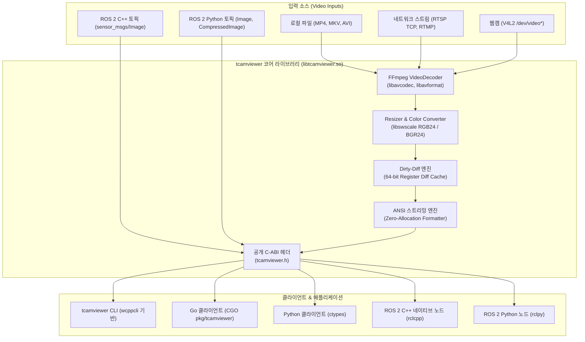

# 시스템 아키텍처 (System Architecture)

`tcamviewer`는 **초저지연(Sub-millisecond latency)**과 **극도의 CPU 효율**을 목표로 설계된 고성능 터미널 비디오 렌더링 라이브러리입니다.

---

## 1. 계층별 시스템 구조

---

## 2. 코어 컴포넌트 역할

| 컴포넌트 | 소스 파일 | 핵심 역할 |
| :--- | :--- | :--- |
| **`Terminal`** | `terminal.hpp`, `terminal.cpp` | • 터미널 창 크기(`ioctl TIOCGWINSZ`) 감지 • Alternate Screen, 커서 숨김/복원 등 ANSI 제어 |
| **`Renderer`** | `renderer.hpp`, `renderer.cpp` | • Half-block(`▀`) 픽셀 매핑 및 다운스케일링 • 프레임 간 Dirty-diff 캐시 비교 및 점프 출력 • Zero-Allocation 인라인 ANSI 시퀀스 스트리밍 |
| **`VideoDecoder`** | `decoder.hpp`, `decoder.cpp` | • FFmpeg 기반 비디오 스트림 역다중화(Demuxing) 및 디코딩 • 비디오 메타데이터 및 회전 각도(Display Matrix) 자동 추출 • 터미널 출력 해상도에 맞춘 선제적 다운스케일 변환 |
| **`C-ABI`** | `tcamviewer.h`, `c_api.cpp` | • 타 언어(C, Go, Python, Rust) 바인딩용 표준 C 인터페이스 노출 |

---

## 3. 제로카피 C-ABI 설계 원칙

- **메모리 복사 최소화**: `rclcpp`나 OpenCV에서 전달받은 `uint8_t*` 이미지 포인터를 복사 없이 직접 순회하여 그리드를 구성합니다.
- **예측 가능한 수명주기**: 생성(`create`)과 소멸(`destroy`) 함수를 명시적으로 분리하여 Go의 가비지 컬렉터나 Python의 참조 카운터와 충돌 없이 완벽한 메모리 관리가 가능합니다.
